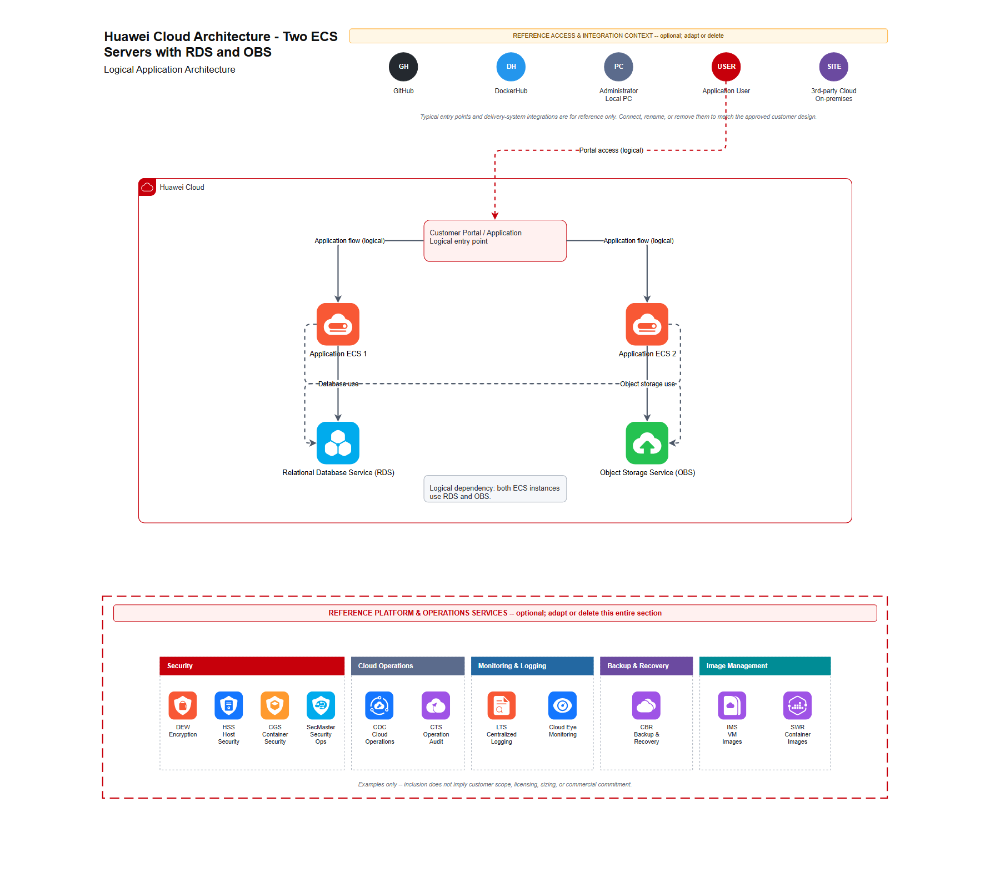

# Huawei Cloud Draw.io Skill

Generate self-contained, editable [diagrams.net / Draw.io](https://www.diagrams.net/) architecture diagrams using bundled Huawei Cloud service icons and Huawei Cloud enclosure groups.

This repository is an Agent Skill that can be installed in Codex, Claude Code, Cursor, and Google Antigravity. It converts a natural-language Huawei Cloud architecture request into a JSON specification and then uses a deterministic Python generator to produce valid `.drawio` XML.



## Highlights

- Bundled color Huawei Cloud service icons with no external image URLs.
- Editable Huawei Cloud, Region, Availability Zone, VPC, Subnet, Security Group, CCE, and Auto Scaling Group containers.
- Self-contained, uncompressed Draw.io XML that remains easy to edit in diagrams.net.
- Standard editable architecture title and external access/integration context.
- Standard optional operations footer covering Security, Cloud Operations, Monitoring & Logging, Backup & Recovery, and Image Management.
- Exact icon lookup against the bundled catalog instead of guessed or substituted graphics.
- Validation for duplicate IDs, broken references, malformed image styles, truncated data URIs, detached Base64 tokens, and invalid embedded SVG content.
- No third-party Python packages required.
- Regression coverage for Huawei Cloud group templates and embedded service icons.

## What the skill generates

A typical result contains:

1. A visible, editable architecture title.
2. Optional reference actors such as Application User, Administrator, GitHub, DockerHub, and third-party/on-premises systems.
3. The requested Huawei Cloud architecture using exact bundled service icons.
4. Logical, labeled connectors that avoid inventing unspecified network details.
5. An editable reference footer with Huawei Cloud operational services.

The header and footer are included by default, even for small architectures. They are visibly marked as reference content and can be edited or deleted in diagrams.net. They are removed only when the user explicitly requests a clean canvas or no reference regions.

## Requirements

- Git
- Python 3.10 or later
- Codex, Claude Code, Cursor, or Google Antigravity
- diagrams.net / Draw.io for opening and editing the generated file

The generator uses only the Python standard library. On macOS or Linux, use `python3` instead of `python` if that is the name of your Python executable.

## Repository structure

```text
hwc-drawio-skill/
├── SKILL.md                         Agent instructions and trigger metadata
├── agents/openai.yaml               Codex display metadata
├── assets/libraries/                Bundled Huawei Cloud Draw.io libraries
├── references/icon-catalog.md       Searchable icon and group catalog
├── references/specification.md      JSON specification reference
├── scripts/hwc_drawio.py            Generator, catalog search, and validator
├── samples/                          Example specifications and diagrams
└── tests/test_hwc_drawio.py         Regression tests
```

## Installation

Replace `fWd82` in the commands below with the GitHub account or organization that hosts this repository.

Repository URL used in the examples:

```text
https://github.com/fWd82/HWC-DrawIO-Skill.git
```

### Codex

Codex discovers personal skills under `~/.agents/skills` and repository-specific skills under `.agents/skills`.

#### Personal installation: macOS or Linux

```bash
mkdir -p ~/.agents/skills
git clone https://github.com/fWd82/HWC-DrawIO-Skill.git \
  ~/.agents/skills/hwc-drawio-skill
```

#### Personal installation: Windows PowerShell

```powershell
New-Item -ItemType Directory -Force "$HOME\.agents\skills" | Out-Null
git clone https://github.com/fWd82/HWC-DrawIO-Skill.git `
  "$HOME\.agents\skills\hwc-drawio-skill"
```

#### Project-specific installation

Run from the target project root:

```bash
mkdir -p .agents/skills
git clone https://github.com/fWd82/HWC-DrawIO-Skill.git \
  .agents/skills/hwc-drawio-skill
```

PowerShell:

```powershell
New-Item -ItemType Directory -Force ".agents\skills" | Out-Null
git clone https://github.com/fWd82/HWC-DrawIO-Skill.git `
  ".agents\skills\hwc-drawio-skill"
```

You can also ask Codex to install it:

```text
Use $skill-installer to install the skill from
https://github.com/fWd82/HWC-DrawIO-Skill
```

If Codex does not show the newly installed skill, restart Codex. Verify it with `/skills` or mention it directly:

```text
$hwc-drawio-skill Create an editable Huawei Cloud architecture with two ECS instances, one RDS, and one OBS.
```

Official reference: [OpenAI — Build skills](https://developers.openai.com/codex/skills)

### Claude Code

Claude Code loads personal skills from `~/.claude/skills` and project skills from `.claude/skills`.

#### Personal installation: macOS or Linux

```bash
mkdir -p ~/.claude/skills
git clone https://github.com/fWd82/HWC-DrawIO-Skill.git \
  ~/.claude/skills/hwc-drawio-skill
```

#### Personal installation: Windows PowerShell

```powershell
New-Item -ItemType Directory -Force "$HOME\.claude\skills" | Out-Null
git clone https://github.com/fWd82/HWC-DrawIO-Skill.git `
  "$HOME\.claude\skills\hwc-drawio-skill"
```

#### Project-specific installation

```bash
mkdir -p .claude/skills
git clone https://github.com/fWd82/HWC-DrawIO-Skill.git \
  .claude/skills/hwc-drawio-skill
```

Invoke the skill explicitly with:

```text
/hwc-drawio-skill Create a Huawei Cloud architecture diagram for a three-tier application.
```

Claude Code watches existing skill directories for changes. Restart Claude Code if the top-level skills directory was created after the session started.

Official reference: [Anthropic — Extend Claude with skills](https://code.claude.com/docs/en/skills)

### Cursor

Cursor supports both `.agents/skills` and `.cursor/skills` at project and personal scope. Using `.agents/skills` is convenient when sharing the same installation with Codex.

#### Personal installation

```bash
mkdir -p ~/.agents/skills
git clone https://github.com/fWd82/HWC-DrawIO-Skill.git \
  ~/.agents/skills/hwc-drawio-skill
```

#### Project-specific installation

```bash
mkdir -p .agents/skills
git clone https://github.com/fWd82/HWC-DrawIO-Skill.git \
  .agents/skills/hwc-drawio-skill
```

Alternatively, use Cursor's GitHub import:

1. Open **Customize** in the Cursor sidebar.
2. Open **Rules** and select **Add Rule**.
3. Select **Remote Rule (GitHub)**.
4. Paste the repository URL.

Invoke the skill through natural language or explicitly:

```text
/hwc-drawio-skill
```

Official reference: [Cursor — Agent Skills](https://cursor.com/docs/skills)

### Google Antigravity

Antigravity uses `.agents/skills` for workspace-specific skills and `~/.gemini/config/skills` for global skills.

#### Global installation: macOS or Linux

```bash
mkdir -p ~/.gemini/config/skills
git clone https://github.com/fWd82/HWC-DrawIO-Skill.git \
  ~/.gemini/config/skills/hwc-drawio-skill
```

#### Global installation: Windows PowerShell

```powershell
New-Item -ItemType Directory -Force "$HOME\.gemini\config\skills" | Out-Null
git clone https://github.com/fWd82/HWC-DrawIO-Skill.git `
  "$HOME\.gemini\config\skills\hwc-drawio-skill"
```

#### Workspace-specific installation

```bash
mkdir -p .agents/skills
git clone https://github.com/fWd82/HWC-DrawIO-Skill.git \
  .agents/skills/hwc-drawio-skill
```

Ask Antigravity to list its available skills, or invoke this one by name:

```text
Use hwc-drawio-skill to create an editable Huawei Cloud architecture diagram.
```

Official reference: [Google Antigravity — Skills](https://antigravity.google/docs/skills)

## Verify the installation

Change into the installed skill directory and run:

```bash
python --version
python -m unittest discover -s tests -v
python scripts/hwc_drawio.py search "Elastic Cloud Server"
python scripts/hwc_drawio.py validate samples/two-ecs-rds-obs-portal.drawio
```

Expected results include:

- Python 3.10 or newer.
- All unit tests passing.
- A catalog match for `Elastic Cloud Server (ECS)`.
- A `valid:` message for the sample Draw.io file.

## Usage examples

After installation, ask the agent naturally. Examples:

```text
Create an editable Huawei Cloud architecture with two ECS servers,
one RDS database, and one OBS bucket. Both servers use RDS and OBS.
```

```text
Generate a multi-AZ Huawei Cloud web architecture with a public ELB,
application ECS instances, and RDS for MySQL. Label known protocols,
but do not invent CIDRs or security rules.
```

```text
Create a CCE architecture inside a Huawei Cloud VPC with two subnets.
Keep the standard title and reference footer.
```

```text
Generate the diagram without the standard reference header and footer.
I want a clean canvas.
```

The final prompt explicitly requests a clean canvas, so the generated specification may use `"reference": false`. Short or simple prompts do not disable the standard reference regions.

## Command-line usage

The agent normally creates the JSON specification and runs the generator for you. The command-line interface is also available directly.

### Search for icons and groups

```bash
python scripts/hwc_drawio.py search "object storage"
python scripts/hwc_drawio.py search "vpc" --kind group
```

### Generate a diagram

```bash
python scripts/hwc_drawio.py generate architecture.json architecture.drawio
```

### Validate a diagram

```bash
python scripts/hwc_drawio.py validate architecture.drawio
```

### Regenerate the catalog

```bash
python scripts/hwc_drawio.py catalog --markdown references/icon-catalog.md
```

See [references/specification.md](references/specification.md) for the complete JSON schema and [references/icon-catalog.md](references/icon-catalog.md) for bundled icon and group names.

## Minimal JSON specification

```json
{
  "title": "Huawei Cloud Architecture - ECS with RDS",
  "page": {
    "width": 1400,
    "height": 760
  },
  "reference": {
    "title": "Huawei Cloud Architecture - ECS with RDS",
    "subtitle": "Logical Application Architecture",
    "application_entry": "portal",
    "application_access_label": "Portal access (logical)",
    "ha_guidance": false
  },
  "groups": [
    {
      "id": "cloud",
      "type": "Huawei Cloud",
      "x": 100,
      "y": 80,
      "width": 1100,
      "height": 520
    }
  ],
  "notes": [
    {
      "id": "portal",
      "text": "Customer Portal / Application\nLogical entry point",
      "x": 430,
      "y": 70,
      "width": 240,
      "height": 70,
      "parent": "cloud"
    }
  ],
  "nodes": [
    {
      "id": "ecs",
      "icon": "Elastic Cloud Server (ECS)",
      "label": "Application ECS",
      "x": 330,
      "y": 220,
      "parent": "cloud"
    },
    {
      "id": "rds",
      "icon": "Relational Database Service (RDS)",
      "label": "Application Database",
      "x": 700,
      "y": 220,
      "parent": "cloud"
    }
  ],
  "edges": [
    {
      "from": "portal",
      "to": "ecs",
      "label": "Application flow (logical)"
    },
    {
      "from": "ecs",
      "to": "rds",
      "label": "Database use"
    }
  ]
}
```

## Design and safety behavior

- The generator never downloads icons while creating a diagram.
- Generated diagrams do not depend on external image URLs.
- Bundled SVG payloads are copied exactly; they are not decoded, rewritten, or re-encoded.
- The validator rejects malformed or incomplete embedded image styles.
- The skill does not invent unspecified regions, AZs, CIDRs, public IPs, EIPs, ELBs, DNS services, ports, security rules, or HA claims.
- Logical user access is labeled as logical when the ingress implementation is unknown.
- Reference footer services are examples and do not imply customer scope, licensing, sizing, or commercial commitment.

## Updating

Update a Git-based installation with:

```bash
git -C ~/.agents/skills/hwc-drawio-skill pull --ff-only
```

Use the appropriate installation path for Claude Code or Antigravity.

PowerShell example:

```powershell
git -C "$HOME\.agents\skills\hwc-drawio-skill" pull --ff-only
```

After updating, rerun the unit tests. Restart the agent if it does not detect the changed skill automatically.

## Uninstalling

Delete the installed `hwc-drawio-skill` directory from the relevant skills location:

- Codex: `~/.agents/skills/hwc-drawio-skill`
- Claude Code: `~/.claude/skills/hwc-drawio-skill`
- Cursor: `~/.agents/skills/hwc-drawio-skill` or `~/.cursor/skills/hwc-drawio-skill`
- Antigravity: `~/.gemini/config/skills/hwc-drawio-skill`

Project-specific installations are under `.agents/skills/hwc-drawio-skill` or `.claude/skills/hwc-drawio-skill` in the project.

## Troubleshooting

### The agent cannot find the skill

- Confirm the directory is named `hwc-drawio-skill`.
- Confirm `SKILL.md` is directly inside that directory.
- Restart the agent if the skills directory was created after the session started.
- Invoke the skill explicitly by name.

### `python` is not found

Install Python 3.10+ and ensure it is on `PATH`. On macOS/Linux, try `python3`. On Windows, `py -3` may also work.

### An icon name is ambiguous or missing

Search the bundled catalog:

```bash
python scripts/hwc_drawio.py search "service name" --kind icon
```

Use an exact or uniquely matching title from the results.

### A generated file does not open correctly

Run the validator:

```bash
python scripts/hwc_drawio.py validate path/to/diagram.drawio
```

If validation succeeds, open the file in the current version of [diagrams.net](https://app.diagrams.net/) and verify that it was not modified by another XML-processing tool.

## Development

Run the complete regression suite:

```bash
python -m unittest discover -s tests -v
```

Validate the representative samples:

```bash
python scripts/hwc_drawio.py validate samples/icon-rendering-regression.drawio
python scripts/hwc_drawio.py validate samples/two-ecs-rds-obs-portal.drawio
```

When changing bundled libraries, regenerate the icon catalog and rerun all tests.

## Huawei Cloud icon attribution

The bundled Huawei Cloud Draw.io libraries are derived from the publicly available [Huawei Cloud services icons library for draw.io](https://github.com/huaweicloud-latam/drawio-libraries).

Huawei Cloud names, service names, trademarks, logos, and icon artwork remain the property of their respective owners. Their inclusion does not imply sponsorship or endorsement of this project. Review the upstream repository and applicable Huawei Cloud brand and trademark requirements before redistribution or commercial use.

## Contributing

Contributions are welcome. For generator or image-handling changes:

1. Preserve the original bundled icon payloads.
2. Add or update regression tests.
3. Run the complete test suite.
4. Generate and validate a representative `.drawio` sample.
5. Visually inspect it in diagrams.net.

